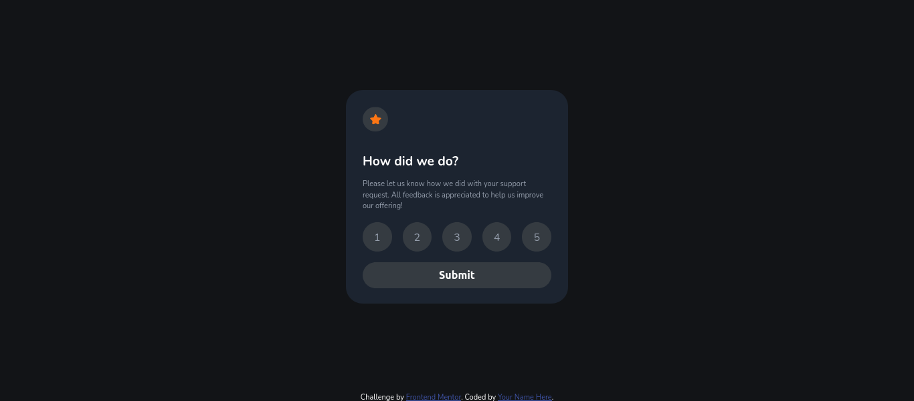

# Frontend Mentor - Interactive rating component solution

This is a solution to the [Interactive rating component challenge on Frontend Mentor](https://www.frontendmentor.io/challenges/interactive-rating-component-koxpeBUmI). Frontend Mentor challenges help you improve your coding skills by building realistic projects. 

## Overview

### The challenge

Users should be able to:

- View the optimal layout for the app depending on their device's screen size
- See hover states for all interactive elements on the page
- Select and submit a number rating
- See the "Thank you" card state after submitting a rating

### Screenshot

- Rating card

- Thank you card

### Links

- Solution URL: [Github](https://github.com/johnjoker13/johnjoker13.github.io)
- Live Site URL: [Live Site](https://johnjoker13.github.io/html/index.html)

## My process

### Built with

- Semantic HTML5 markup
- CSS custom properties
- Flexbox
- Mobile-first workflow
- JavaScript

### Continued development

- CSS positioning
- CSS animations/transitions
- UX/UI

## Author

- Website - [joaoOliveira](https://joao-oliveira-avelino.vercel.app/)
- Frontend Mentor - [@joaoOliveira](https://www.frontendmentor.io/profile/johnjoker13)
